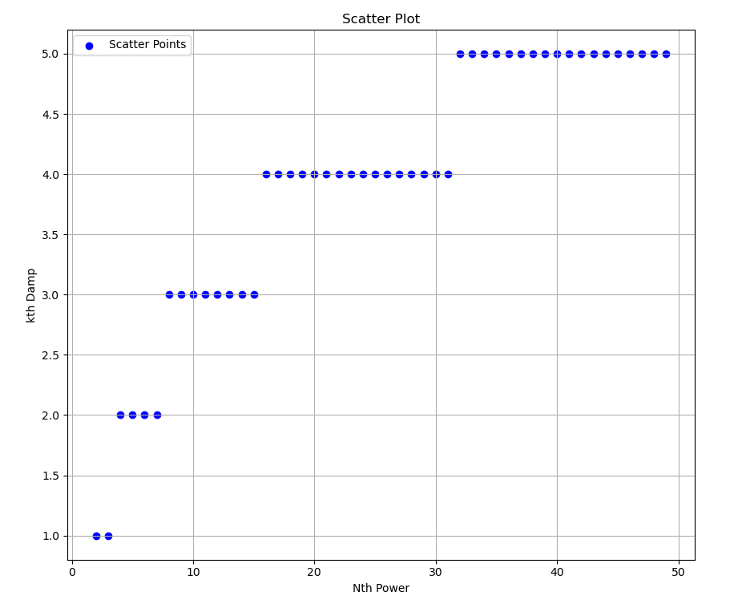

# 1.3.4 函数作为返回值
## 练习1.45
 我们在1.3.3节看到，用朴素方法通过找$y↦x/y$的不动点来计算平方根的方法不收敛，但可以通过均值阻尼的技术弥补。同样的技术也可以用于计算立方根，将其看作均值阻尼后的$y↦x/y^2$的不动点。不幸的是，这个方法对四次方根行不通，一次均值阻尼不足以使对$y↦x/y^3$的不动点搜寻收敛。然而，如果我们求两次均值阻尼（即用$y↦x/y^3$均值阻尼的均值阻尼）​，这一不动点搜寻就收敛了。请做些试验，考虑把计算n次方根作为基于$y↦x/y^{n-1}$的反复做均值阻尼的不动点搜寻过程，请设法确定各种情况下需要做多少次均值阻尼，并基于这一认识实现一个函数，它能利用fixed_point、average_damp和练习1.43的repeated函数计算n次方根。假定你需要的所有算术运算都是基本函数。
 ```javascript
 function fixed_point(f, first_guess) {
    function close_enough(x, y) {
        return abs(x - y) < tolerance;
    }
    function average_damp(f) {
        return function(x) {
            return average(x, f(x));
        };
    }
    function try_with(guess) {
        const next = average_damp(f)(guess);
        return close_enough(guess, next)
            ? next
            : try_with(next);
    }
    return try_with(first_guess);
}
function compose(f,g) {
    return function(x) {
        return f(g(x));
    };
}
function repeated(f,n) {
    return n == 1
           ? f
            : compose(f, repeated(f, n - 1));
}
```

## 解答
* n次方根和k次阻尼的关系如下图:
* 从图中很难看出什么关系，尝试了几个数学函数，接近略小的为log，接近略大的为sqrt，宁大勿小，我选择sqrt。
* python最终代码如下:
```python
def compose(f,g): return lambda x: f(g(x))
def repeated(f,n): 
    if n == 1:
        return f
    else: 
        return compose(f,repeated(f,n-1))

def average_damp(f):
    return lambda x: (x+f(x))/2

def average_damp_fixed_point(f,first_guess,k):
    def close_enough(v1,v2):
        return abs(v1-v2) < 0.00001
    def try_guess(guess):
        next = repeated(average_damp,k)(f)(guess)
        if close_enough(guess,next):
            return next
        else:
            return try_guess(next)
    return try_guess(first_guess)
def nth_root(x,n,k):
    # 若令x为100，n为2，则lambda为lambda y: 100/y**(2-1)，即为求100的平方根，而lambda为对应的不动点函数。
    return average_damp_fixed_point(lambda y: x/y**(n-1),1.0,k)

arr = []    
for n in range(2,100):  # from ^2 ~ ^10
    first_k = 1
    for k in range(1,n): # 1~n次平滑
        try:
            nth_root(1000000,n,k)
            first_k = k
            arr.append((n,k))
            break
        except:
            pass
    print("compute root^%d need %d damp, ismul？ %.2f islog? %.2f, issqrt? %.2f"%(n,k,n*1.0/k,math.log(n),math.sqrt(n)))
print(arr)

# 绘图代码省略
# 最终代码如下:
def nth_root(x,n):
    k = math.ceil(math.sqrt(n))
    return average_damp_fixed_point(lambda y: x/y**(n-1),1.0,k)
```
* 使用repeated时rust代码无法写出，因为repeated函数的参数为Fn(T) -> T，而average_damp的类型为Fn(Fn)->Fn，故无法使用repeated函数。
    * 参考习题1.44 n_smooth重写repeated可以做到，但是较为复杂。
```rust
use num::Float;

fn main() {
    println!("{}", nth_root(1024.0_f64, 10));
}

const TOLERANCE: f64 = 0.00001;
fn close_enough<T: Float + Display>(x: T, y: T) -> bool {
    if let Some(b) = (x - y).abs().to_f64() {
        b < TOLERANCE
    } else {
        false
    }
}

fn fixed_point<T, F>(f: F, mut guess: T) -> T
where
    T: Float + Display,
    F: Fn(T) -> T,
{
    loop {
        let next = f(guess);
        assert!(next.is_finite());

        if close_enough(guess, next) {
            return next;
        }
        guess = next;
    }
}

fn average_damp<T, F>(f: F) -> Box<dyn Fn(T) -> T>
//Box<dyn Fn(T) -> T>
where
    T: Float + Copy,
    F: Fn(T) -> T + 'static, //'static 是必须的，因为我们要把闭包放到 Box 中
{
    Box::new(move |x| (x + f(x)) / (T::one() + T::one()))
}
// 对输入f进行n次平滑
fn n_average_damp<T, F>(f: F, n: i32) -> Box<dyn Fn(T) -> T>
where
    T: Float + Copy + 'static,
    F: Fn(T) -> T + Copy + 'static,
{
    Box::new(move |x: T| {
        let mut n_f: Box<dyn Fn(T) -> T> = Box::new(f); // 初始值是 f
        for _ in 0..n {
            n_f = average_damp(n_f); // 每次平滑后返回的类型仍然是 Box<dyn Fn(T) -> T>
        }
        n_f(x)
    })
}
fn nth_root<T>(x: T, n: i32) -> T
where
    T: Float + Display + 'static,
{
    let n_pow = move |y: T| x / y.powi(n - 1);
    let k=n.to_f64().unwrap().sqrt().ceil().to_i32().unwrap();
    let n_damp = n_average_damp(n_pow, k);
    fixed_point(n_damp, T::one())
}
```