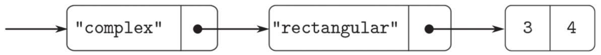

# 2.5.1 通用型算术运算
## 练习2.77
Louis Reasoner试着求值magnitude(z)，其中z是图2.24里的那个对象。

令他吃惊的是，apply_generic得到的不是5而是一个错误信息，说没办法对类型("complex")做操作magnitude。他把这次交互的情况拿给AlyssaP.Hacker看，Alyssa说“问题出在没有为"complex"数定义复数的选择函数，而是只为"polar"和"rectangular"数定义了它们。你需要做的就是在complex 包里加入下面这些东西”​：
```javascript
put('real-part', list("complex"), real-part);
put('imag-part', list("complex"), imag-part);
put('magnitude', list("complex"), magnitude);
put('angle', list("complex"), angle);
```
请详细说明为什么这样做可行。作为例子，请考虑表达式magnitude(z)的求值过程，其中z就是图2.24展示的那个对象。请追踪这个求值过程中的所有函数调用，特别地，请看看apply_generic被调用了几次？每次调用分派到哪个函数？

## 解答
#### 为什么这样做可行？
`complex`类型的数实际上是通过`rectangular` 或`polar`表示的。通过为`"complex"`类型定义这些选择函数，它们会递归调用底层的`rectangular`或`polar`包中的对应函数，从而完成操作。
#### 以`magnitude(z)`为例的求值过程
假设`z`是图 2.24 中的对象，表示为：
```javascript
("complex", ("rectangular", (3.0, 4.0)))
```
我们追踪`magnitude(z)`的求值过程，特别是`apply_generic`的调用情况：
1. 调用`magnitude(z)`，函数`apply_generic`被调用。
    * 它提取`z`的类型标签，得到`"complex"`。
    * 调用`get("magnitude", list("complex"))`，找到`"complex"`类型的`magnitude`函数。
    * 剥去一层标签后，调用`"complex"`的`magnitude`函数。

2. `"complex"`的`magnitude`函数再次调用`apply_generic`。
    * 它提取被剥去标签后的类型标签，得到`"rectangular"`。
    * 调用`get("magnitude", list("rectangular"))`，找到`"rectangular"``类型的`magnitude`函数。
    * 调用`"rectangular"`的`magnitude`函数，计算结果为$\sqrt{3^2+4^2}=5.0$。

最终结果为`5.0`。

#### `apply_generic`的调用次数

在这个例子中，`apply_generic`被调用了**两次**：
1. 第一次处理`"complex"`类型，找到`"complex"`的`magnitude`函数。
2. 第二次处理`"rectangular"`类型，找到`"rectangular"`的`magnitude`函数。

#### Rust输出
运行程序后，输出如下：
```
("complex", ("rectangular", (3.0, 4.0)))
magnitude ("complex", ("rectangular", (3.0, 4.0)))
apply generic op:"magnitude", args:("complex", ("rectangular", (3.0, 4.0)))
magnitude ("rectangular", (3.0, 4.0))
apply generic op:"magnitude", args:("rectangular", (3.0, 4.0))
rectangular magnitude (3.0, 4.0)
5.0
```
#### 完整代码
```rust
use std::rc::Rc;

use sicp_rs::ch2::ch2_4::{attach_tag, contents, type_tag};
use sicp_rs::ch3::ch3_3::make_table_2d;
use sicp_rs::prelude::*;
// 通用型操作：根据操作符和参数调用对应的函数
fn apply_generic(
    op: &List,
    args: &List,
    get: impl Fn(List) -> Option<List> + 'static,
) -> Option<List> {
    let op_cloned = op.clone();
    println!("apply generic op:{}, args:{}", op_cloned, args);
    let type_tags = type_tag(args);
    let op = get(list![op.clone(), type_tags]);
    if let Some(op) = op {
        if let Ok(op) = op.try_as_basis_value::<ClosureWrapper>() {
            return op.call(&contents(args));
        }
    }
    panic!("No method for these types op:{}, args:{}", op_cloned, args);
}
fn magnitude(z: &List, get: impl Fn(List) -> Option<List> + 'static) -> List {
    println!("magnitude {}", z);
    apply_generic(&"magnitude".to_listv(), z, get).unwrap()
}
fn install_rectangular_package(put: impl Fn(List) -> Option<List> + 'static) -> Option<List> {
    let real_part = ClosureWrapper::new(move |x: &List| Some(x.head()));

    let imag_part = ClosureWrapper::new(move |x: &List| Some(x.tail()));

    let (real_cloned, imag_cloned) = (real_part.clone(), imag_part.clone());
    let magnitude = ClosureWrapper::new(move |x: &List| {
        println!("rectangular magnitude {}", x);
        let rp_list = real_cloned.call(x).unwrap();
        let rp = rp_list.try_as_basis_value::<f64>().unwrap();
        let ip_list = imag_cloned.call(x).unwrap();
        let ip = ip_list.try_as_basis_value::<f64>().unwrap();
        Some((rp * rp + ip * ip).sqrt().to_listv())
    });

    let make_from_real_imag = |x: List, y: List| pair![x, y];
    let tag = |x| attach_tag("rectangular", &x);
    put(list!["real_part", "rectangular", real_part]);
    put(list!["imag_part", "rectangular", imag_part]);
    put(list!["magnitude", "rectangular", magnitude]);
    put(list![
        "make_from_real_imag",
        "rectangular",
        ClosureWrapper::new(move |args: &List| {
            let x = args.head();
            let y = args.tail().head();
            Some(tag(make_from_real_imag(x, y)))
        })
    ]);
    Some("done".to_string().to_listv())
}

fn install_polar_package(put: impl Fn(List) -> Option<List> + 'static) -> Option<List> {
    let magnitude = ClosureWrapper::new(move |x: &List| Some(contents(x).head()));
    put(list!["magnitude", "polar", magnitude]);
    Some("done".to_string().to_listv())
}
fn install_complex_packages(
    get: impl Fn(List) -> Option<List> + 'static,
    put: impl Fn(List) -> Option<List> + 'static,
) -> Option<List> {
    let make_from_real_imag = move |x: List, y: List| {
        get(list!["make_from_real_imag", "rectangular"])
            .unwrap()
            .try_as_basis_value::<ClosureWrapper>()
            .unwrap()
            .call(&list![x, y])
            .unwrap()
    };
    let tag = |x| attach_tag("complex", &x);
    let tag_cloned = tag.clone();
    put(list![
        "make_from_real_imag",
        "complex",
        ClosureWrapper::new(move |args: &List| {
            let x = args.head();
            let y = args.tail().head();
            Some(tag_cloned(make_from_real_imag(x.clone(), y.clone())))
        })
    ]);

    Some("done".to_string().to_listv())
}
fn make_complex_from_real_imag(x: List, y: List, get: impl Fn(List) -> Option<List>) -> List {
    get(list!["make_from_real_imag", "complex"])
        .unwrap()
        .try_as_basis_value::<ClosureWrapper>()
        .unwrap()
        .call(&list![x, y])
        .unwrap()
}

fn main() {
    // 创建操作符表
    let optable: Rc<dyn Fn(&str) -> ClosureWrapper> = make_table_2d();
    let op_cloned = optable.clone();
    let get = move |args: List| optable("lookup").call(&args);
    let put = move |args: List| op_cloned("insert").call(&args);
    println!("{:?}", install_rectangular_package(put.clone()));
    println!("{:?}", install_polar_package(put.clone()));
    println!("{:?}", install_complex_packages(get.clone(), put.clone()));
    let a = make_complex_from_real_imag(3.0.to_listv(), 4.0.to_listv(), get.clone());
    println!("{}", a);
    let get_cloned = get.clone();
    let magnitude_wrapper =
        ClosureWrapper::new(move |x: &List| Some(magnitude(x, get_cloned.clone())));
    put(list!["magnitude", "complex", magnitude_wrapper]);
    println!("{}", magnitude(&a, get.clone()))
}
```